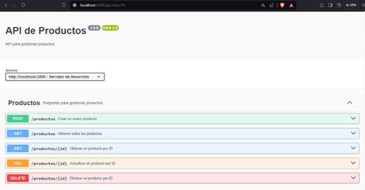
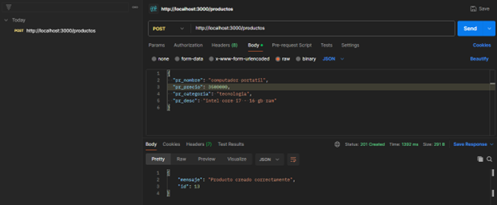
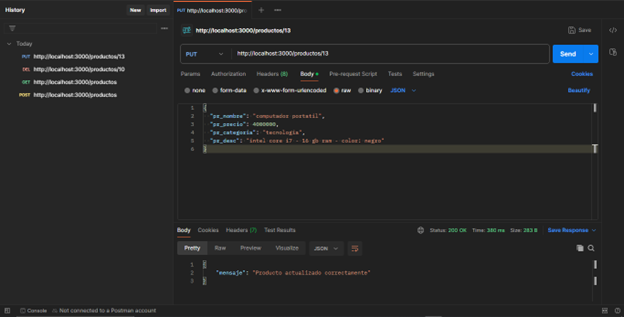
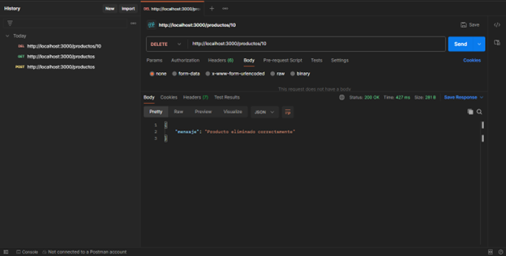

# CRUD-API
Servicio de API desarrollada usando Nodejs y Express que por medio de un CRUD básico permite manipular la tabla de productos.

#### DOCUMENTACION: Swagger
Swagger es un conjunto de herramientas que facilita la documentación, prueba y diseño de APIs. Utiliza la especificación Swagger (o OpenAPI) para describir la estructura de una API, incluyendo detalles sobre recursos, métodos, parámetros y respuestas. La documentación generada es interactiva, permitiendo a los desarrolladores explorar y probar la API directamente desde Swagger UI. Además, Swagger ofrece validación en tiempo real, generación de código automática y herramientas complementarias para simplificar el proceso de desarrollo y adopción 
de APIs, mejorando la comprensión y usabilidad de los servicios web.

    

<h5 align='center'>INSERT: Crear un producto en la base de datos.</h5>

    

<h5 align='center'>READ: Consultar todos los productos de la base de datos.</h5>

    

<h5 align='center'>UPDATE: actualizar la información del producto.</h5>

    

<h5 align='center'>DELETE: eliminar un producto registrado.</h5>

    

